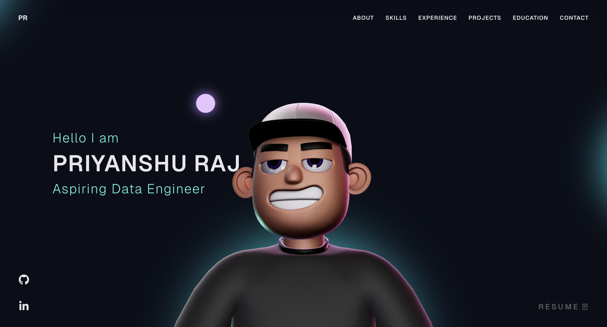
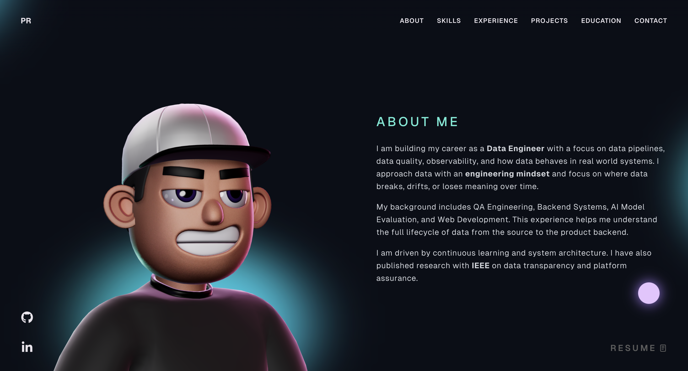
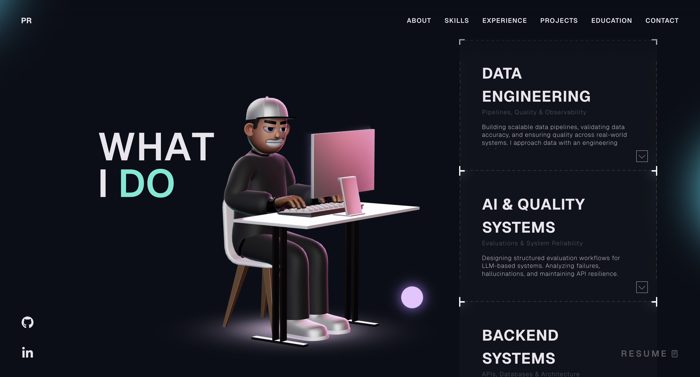
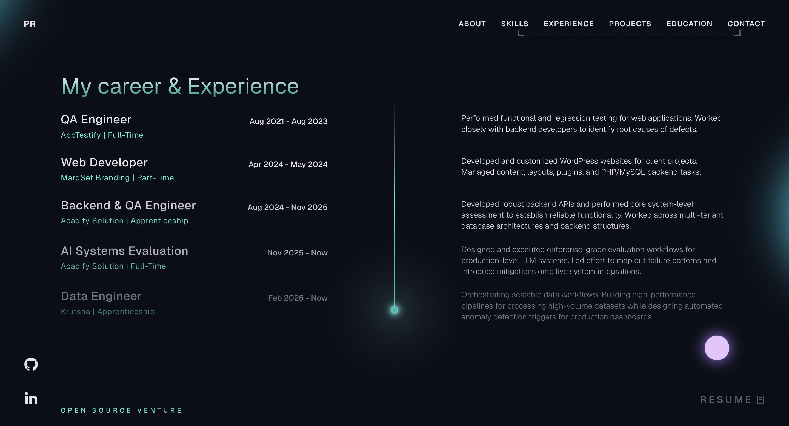
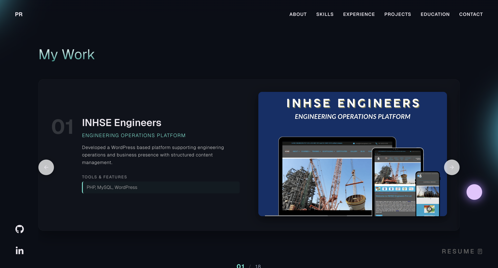
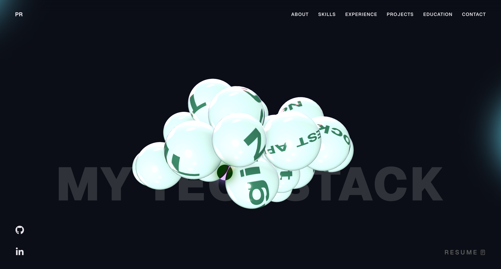

# 3D Interactive Portfolio | Priyanshu Raj 🚀

A high-performance, responsive 3D interactive portfolio website featuring continuous rigid physics simulations, fluid glassmorphisms, and smooth scrolling interactions. 

## 📸 Preview

  
  

  
  

  
  

## 🛠️ Tech Stack
- **Framework & Logic**: React, TypeScript, Node.js
- **3D & Visuals**: Three.js, React Three Fiber (R3F), WebGL
- **Animation Framework**: GSAP, ScrollTrigger, Lenis (Smooth Scroll)
- **Physics Engine**: `@react-three/rapier` (Rigid Body Colliders)

## ✨ Key Features
- **Deterministic 3D Tech Spheres**: Rigid physics collision bounding layout renders without duplicate overrides.
- **Glassmorphic Grids Frames**: Transparent blur frameworks layout across sections balancing light gradients natively.
- **Continuous Lenis Native Scrolls**: Fully compatible seamless coordinate buffers satisfying desktop requirements accurately.

## 🌐 Live Portfolio
<a href="https://i-priyanshu.netlify.app/" target="_blank" rel="noopener noreferrer">
  <button>Visit My Portfolio</button>
</a>

## 🚀 Usage & Setup
1. **Clone the Repo**
2. **Install Dependencies**: `npm install`
3. **Run Dev Continuous Continuous**: `npm run dev`

---
### 🔒 License
**Copyright © 2026 Priyanshu Raj. All Rights Reserved.**

Strictly proprietary. Decryption, unauthorized distribution, or commercial usage of interactive 3D elements/structures is forbidden. All authorship branding required to stay continuous.

